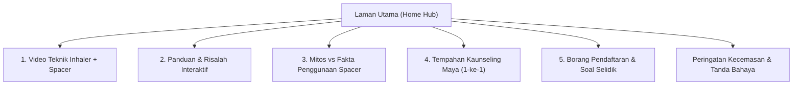

# Pelan Tindakan & Panduan Pembinaan Google Sites
## Projek: Penambahbaikan Akses kepada Kaunseling Inhaler bagi Pesakit Pediatrik di Jabatan Kecemasan HTA Selepas Waktu Pejabat melalui Kaunseling Maya

Panduan ini disediakan khas untuk pasukan projek **Jabatan Farmasi & Jabatan Kecemasan Hospital Tunku Azizah (HTA)** bagi membina laman web rasmi di **Google Sites** ([sites.google.com](https://sites.google.com)) dengan pantas, teratur, dan mesra pengguna telefon pintar.

---

## 1. Maklumat Asas & Pautan Penting Projek

| Perkara | Pautan / Maklumat |
| :--- | :--- |
| **Pautan Borang Google Form** | [Borang Pendaftaran Penggunaan MDI ED HTA](https://docs.google.com/forms/d/e/1FAIpQLSdbc_V0vNJGwOBjQc99oGPHtiqCZVSrxpMwy13WyE7a8-4Cvw/viewform?usp=header) |
| **Pautan Tempahan Kalendar** | [Google Calendar Appointment Schedule (30 minit)](https://calendar.app.google/gtarUVDkAM463Yxk8) |
| **Pautan Video Teknik KKM** | [Cara Guna Spacer dengan Corong Muka (YouTube)](https://youtu.be/CeXpwhD1-eU) |
| **Pautan Portal Linktree Sedia Ada** | [https://linktr.ee/kaunseling.hta](https://linktr.ee/kaunseling.hta) |
| **Sasaran Pengguna** | Ibu bapa / penjaga pesakit pediatrik yang menerima MDI Salbutamol di ED Hospital Tunku Azizah. |
| **Waktu Kaunseling Maya** | Isnin – Jumaat: Sesi Pagi (**8:30 AM – 10:00 AM**) & Sesi Petang (**3:00 PM – 4:30 PM**) |
| **Platform Maya** | Google Meet / WhatsApp Video Call (30 minit setiap sesi) |

---

## 2. Struktur Halaman Google Sites (Page Hierarchy)

Untuk memudahkan capaian ibu bapa yang mengimbas kod QR di kaunter kecemasan atau kotak ubat, struktur Google Site boleh dibahagikan kepada 5 tab utama (atau satu halaman pendaratan *single-page* dengan pautan sauh / *anchor links*):



---

## 3. Langkah Demi Langkah Membina di Google Sites (sites.google.com)

### Langkah 1: Cipta Tapak Baharu
1. Buka [sites.google.com](https://sites.google.com) dan log masuk menggunakan akaun rasmi Google Workspace HTA / KKM.
2. Klik **Blank site** (+) untuk memulakan tapak baharu.
3. Namakan dokumen tapak di penjuru atas kiri: `HTA - Kaunseling Inhaler Pediatrik ED`.

### Langkah 2: Tetapan Tema (Theme & Branding)
1. Pergi ke tab **Themes** (kanan skrin) &rarr; pilih tema **Aristotle** atau **Vision**.
2. Pilih warna aksen: **Teal / Ocean Blue** (sepadan dengan warna inhaler Salbutamol biru dan warna korporat KKM).
3. Masukkan logo HTA di bahagian Header (`Logo` & `Favicon`).

---

## 4. Susunan Kandungan Mengikut Seksyen (Copy-Paste Text & Layouts)

### A. Sepanduk Peringatan Kecemasan (Top Announcement Banner)
Di Google Sites: Klik **Settings (Gear icon)** &rarr; **Announcement Banner** &rarr; Aktifkan:
* **Show banner:** On
* **Banner color:** Red / Crimson
* **Message:** `⚠️ PERHATIAN: Portal ini adalah untuk panduan teknik ubat. Jika anak anda mengalami sesak nafas teruk (nafas laju, dada berombak, atau bibir pucat/biru), sila bawa segera ke Jabatan Kecemasan HTA!`
* **Button label:** `Tanda Bahaya`
* **Link:** Pautkan ke bahagian `#tanda-bahaya`

---

### B. Header / Hero Banner
* **Tajuk Header (Banner Title):**
  > **Nafas yang Lega, Langkah yang Ceria untuk Si Kecil**
* **Sub-tajuk:**
  > *Portal Panduan Teknik Inhaler & Spacer Pesakit Pediatrik Jabatan Kecemasan Hospital Tunku Azizah (Selepas Waktu Pejabat)*
* **Dua Butang Tindakan (Buttons):**
  1. Butang 1: **Tempah Kaunseling Maya Percuma** &rarr; Pautan: `https://calendar.app.google/gtarUVDkAM463Yxk8`
  2. Butang 2: **Tonton Video Teknik** &rarr; Pautan: Ke seksyen Video di bawah

---

### C. Seksyen 1: Tempahan Kaunseling Maya Bersama Pegawai Farmasi (Keutamaan Projek)
*Gunakan susun atur 2-kolum (Text + Card/Button):*

* **Tajuk:** Perlukan Bantuan Menggunakan Inhaler? Jumpa Pegawai Farmasi Secara Maya!
* **Teks Penerangan:**
  > Adakah anda berasa kurang pasti sama ada teknik sedutan ubat anak anda sudah tepat? Pegawai Farmasi Hospital Tunku Azizah sedia membimbing anda secara **1-ke-1 dari rumah secara PERCUMA** melalui panggilan video Google Meet atau WhatsApp.
* **Maklumat Waktu:**
  * **Hari:** Isnin hingga Jumaat
  * **Sesi Pagi:** 8:30 AM – 10:00 AM
  * **Sesi Petang:** 3:00 PM – 4:30 PM
  * **Durasi:** 30 Minit bagi setiap sesi
* **Langkah Mengikuti Sesi:**
  1. **Langkah 1:** Pilih slot temujanji yang sesuai di [Google Calendar Appointment Schedule](https://calendar.app.google/gtarUVDkAM463Yxk8).
  2. **Langkah 2:** Lengkapkan [Borang Pendaftaran Penggunaan MDI](https://docs.google.com/forms/d/e/1FAIpQLSdbc_V0vNJGwOBjQc99oGPHtiqCZVSrxpMwy13WyE7a8-4Cvw/viewform?usp=header).
  3. **Langkah 3:** Pegawai Farmasi akan menghantar peringatan & pautan Google Meet / WhatsApp sebelum sesi.
  4. **Langkah 4:** Sediakan ubat inhaler dan spacer anak anda semasa sesi bimbingan bermula.

---

### D. Seksyen 2: Video Pengajaran Teknik Inhaler Bersama Spacer & Corong Muka
*Di Google Sites: Klik **Insert** &rarr; **YouTube** &rarr; Cari URL atau masukkan kod video `CeXpwhD1-eU`:*
* **Pautan Video:** `https://youtu.be/CeXpwhD1-eU`
* **Tajuk Video:** *Cara Guna Spacer dengan Corong Muka (Face Mask) yang Betul | Teknik Penggunaan Inhaler*
* **Penerbit:** Bahagian Amalan dan Perkembangan Farmasi, Kementerian Kesihatan Malaysia (KKM)

*Di sebelah video, letakkan kotak teks intipati langkah:*
1. **Goncang kanister:** Secara menegak sekurang-kurangnya 5 saat.
2. **Sambungkan ke spacer:** Masukkan ke bukaan getah spacer secara tegak.
3. **Tekup corong muka rapat:** Tutup hidung dan mulut anak tanpa celah kebocoran udara.
4. **Tekan 1 PAM SAHAJA:** Lepaskan 1 dos semburan ke dalam ruang spacer.
5. **Sedut 5 hingga 6 nafas santai:** Biarkan anak bernafas perlahan dan tenang (perhatikan pergerakan injap).
6. **Jarak masa pam kedua:** Jika doktor mempreskripsikan 2 pam, tunggu 30-60 saat sebelum mengulangi langkah di atas.

---

### E. Seksyen 3: Risalah Digital (Kaedah Penggunaan Inhaler)
*Gunakan Collapsible Group atau 3-Column Layout:*

#### 1. Kenali Inhaler Anda
* **Inhaler Pelega (Reliever - Salbutamol / Biru):**
  * Digunakan **semasa sesak nafas** atau batuk berterusan untuk membuka saluran pernafasan dengan segera.
* **Inhaler Pencegah (Preventer - Coklat / Oren / Ungu):**
  * Mengandungi ubat antiradang (steroid). Perlu digunakan **setiap hari secara konsisten** walaupun anak tiada simptom. Ingat untuk berkumur / lap muka anak selepas guna.

#### 2. Mengapa Wajib Guna Spacer pada Kanak-Kanak?
* Semburan ubat keluar sangat laju (~100km/j).
* **Tanpa spacer, sebanyak 80% ubat termendap di tekak** dan tertelan ke perut tanpa sampai ke paru-paru.
* Spacer memerangkap ubat supaya anak boleh menyedutnya secara santai melalui pernafasan biasa (*tidal breathing*).

---

### F. Seksyen 4: Mitos vs Fakta Penggunaan Spacer (Panduan Pesakit HTA)
*Boleh masukkan terus imej poster rasmi `mitos_vs_fakta.jpg` ATAU masukkan teks kad berikut:*

| No | MITOS (Salah) | FAKTA (Betul) |
| :---: | :--- | :--- |
| **1** | **Mitos:** Apabila kanak-kanak semakin membesar, mereka boleh berhenti menggunakan spacer.<br>*(80% ubat termendap di tekak tanpa spacer)* | **Fakta:** Semua peringkat umur memerlukan spacer, jika tiada koordinasi.<br>Semburan MDI keluar pada halaju tinggi; spacer memerangkap semburan ubat supaya anak anda dapat menghirupnya dengan tenang dan berkesan. |
| **2** | **Mitos:** Anda boleh menekan dua pam ke dalam spacer pada satu masa untuk jimat masa.<br>*(Zarah ubat berlanggar & melekat pada dinding spacer)* | **Fakta:** Anda mestilah hanya menekan inhaler SATU KALI untuk setiap satu pam.<br>Goncang MDI, tekan satu kali, biarkan anak bernafas 5-6 kali, tunggu 30-60 saat, kemudian ulang untuk pam kedua. |
| **3** | **Mitos:** Adalah wajar untuk memberikan ubat semasa anak sedang menangis.<br>*(Tangisan menyebabkan hembusan nafas pendek & sempitkan saluran)* | **Fakta:** Menangis mengurangkan jumlah ubat yang sampai ke paru-paru secara drastik.<br>Tenangkan anak anda dahulu sebelum memberikan dos ubat. |
| **4** | **Mitos:** Lebih laju dan kuat anak menarik nafas, lebih baik.<br>*(Jika mendengar bunyi wisel AeroChamber, sedutan terlalu laju)* | **Fakta:** Sedutan perlulah perlahan, tenang, dan dalam.<br>Minta mereka perlahankan sedutan sehingga tiada bunyi wisel. |
| **5** | **Mitos:** Gosok bahagian dalam spacer dengan berus dan keringkan dengan tuala.<br>*(Mengelap menghasilkan elektrostatik yang memerangkap ubat)* | **Fakta:** Jangan sekali-kali menggosok atau mengelap bahagian dalam spacer.<br>Buka komponen seminggu sekali, rendam dalam air sabun suam cecair pencuci pinggan standard. Jangan bilas buihnya (lapisan sabun bertindak sebagai penghalang elektrostatik). Biarkan ia kering di udara semalaman sebelum dipasang semula. |

---

### G. Seksyen 5: Tanda-Tanda Bahaya (Emergency Red Flags)
*Gunakan Text Box berlatar belakang merah / amaran:*
* **Bila Perlu Segera ke Kecemasan HTA (24 Jam)?**
  1. Nafas terlalu laju atau dada dan tulang rusuk berlekuk ke dalam (*chest indrawing*).
  2. Bibir, lidah, atau kuku kelihatan pucat atau kebiruan (*cyanosis*).
  3. Anak sukar bercakap dalam ayat penuh atau bayi tidak mampu menghisap susu.
  4. Anak kelihatan lemah, mengantuk luar biasa, atau tidak responsif selepas diberikan dos Salbutamol.
* *Jika berlaku tanda di atas, hubungi **999** atau terus ke **Jabatan Kecemasan & Trauma Hospital Tunku Azizah** segera!*

---

### H. Seksyen 6: Integrasi Google Form (Borang Pendaftaran)
Di Google Sites:
1. Klik menu **Insert** di panel sebelah kanan.
2. Skrol ke bawah dan pilih **Forms**.
3. Pilih fail borang: `Borang Pendaftaran Penggunaan Metered-Dose Inhaler (MDI) bagi Pesakit Jabatan Kecemasan Hospital Tunku Azizah`.
4. Borang akan dipaparkan secara interaktif terus di dalam laman web Google Sites tanpa ibu bapa perlu membuka pautan berasingan.

---

## 5. Cara Memasukkan Widget Interaktif ke dalam Google Sites

Jika anda ingin memasukkan kad interaktif atau kalkulator semakan sendiri (*Checklist*) ke dalam Google Sites:
1. Di Google Sites, klik menu **Insert** &rarr; pilih **Embed (<>)**.
2. Pilih tab **Embed code**.
3. Tampalkan kod HTML dari fail `index.html` atau kod ringkas di bawah:

```html
<!-- Kod Embed Ringkas: Butang Tempahan & Video Hub -->
<div style="font-family: sans-serif; text-align: center; padding: 20px; background: #f0fdf4; border-radius: 16px; border: 1px solid #bbf7d0;">
  <h3 style="color: #166534; margin-bottom: 8px;">Konsultasi Maya Bersama Pegawai Farmasi HTA</h3>
  <p style="color: #374151; font-size: 14px; margin-bottom: 16px;">Sesi bimbingan 1-ke-1 secara percuma mengikut kelapangan anda.</p>
  <a href="https://calendar.app.google/gtarUVDkAM463Yxk8" target="_blank" style="background: #0284c7; color: white; padding: 12px 24px; border-radius: 8px; text-decoration: none; font-weight: bold; display: inline-block; margin-right: 8px;">Pilih Slot Kalendar</a>
  <a href="https://docs.google.com/forms/d/e/1FAIpQLSdbc_V0vNJGwOBjQc99oGPHtiqCZVSrxpMwy13WyE7a8-4Cvw/viewform?usp=header" target="_blank" style="background: white; color: #1f2937; border: 1px solid #d1d5db; padding: 12px 24px; border-radius: 8px; text-decoration: none; font-weight: bold; display: inline-block;">Isi Borang Pendaftaran</a>
</div>
```

---

## 6. Panduan Penerbitan & Kod QR (QR Code Generation)

Setelah laman Google Sites siap dibina:
1. Klik butang **Publish** di sudut atas kanan.
2. Tetapkan Web Address: contohnya `hta-kaunseling-inhaler` (URL tapak akan menjadi: `https://sites.google.com/view/hta-kaunseling-inhaler`).
3. Tetapkan capaian: Pastikan **Who can view my site** disetkan kepada **Anyone (Public)** agar ibu bapa boleh membuka tanpa perlu sign-in Google.
4. Salin URL laman web yang telah diterbitkan dan jana Kod QR percuma (cth: melalui Canva, QR Code Generator, atau Google Chrome `Right Click > Create QR Code for this Page`).
5. **Cetak Kod QR untuk 2 Kegunaan (seperti dalam slaid projek):**
   * **Kegunaan 1:** Kad imbasan di kaunter farmasi / jururawat kecemasan semasa penyerahan ubat (*Slide 4*).
   * **Kegunaan 2:** Pelekat Kod QR bersaiz kecil untuk ditampal terus di kotak ubat inhaler MDI Salbutamol pesakit supaya ibu bapa boleh mengimbas kembali bila-bila masa di rumah (*Slide 4*).

---

## 7. Penyelarasan Aliran Kerja Klinikal (Berdasarkan Slaid Projek)

* **Fasa 1 (Jabatan Kecemasan):**
  * Doktor mempreskrib MDI Salbutamol kepada pesakit.
  * Jururawat Terlatih (JT) membekalkan ubat dan meminta penjaga mengimbas Kod QR portal rujukan / borang pendaftaran.
* **Fasa 2 (Farmasi Klinik Pakar):**
  * Pegawai Farmasi menyemak pendaftaran masuk di Google Form & Google Calendar.
  * Pegawai Farmasi menghantar peringatan WhatsApp & persetujuan digital penjaga.
  * Pegawai Farmasi menjalankan sesi kaunseling maya secara langsung (Google Meet / WhatsApp Video).
  * Pegawai Farmasi mengisi senarai semak penilaian teknik *Paediatric MDI with Spacer Technique Checklist* (Pre vs Post test).
